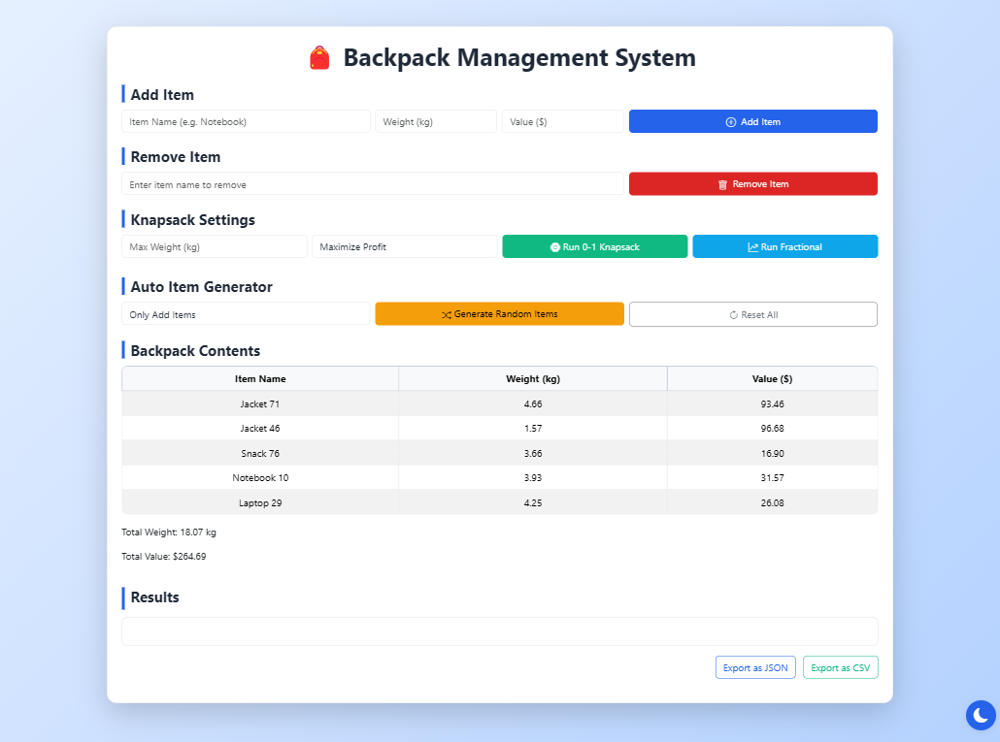
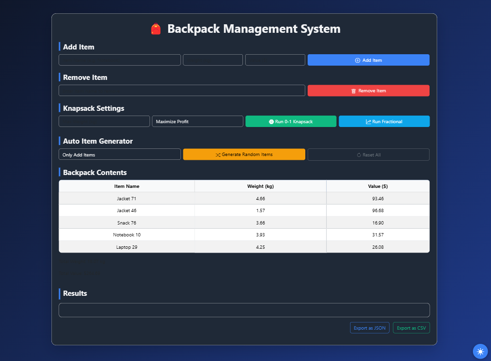
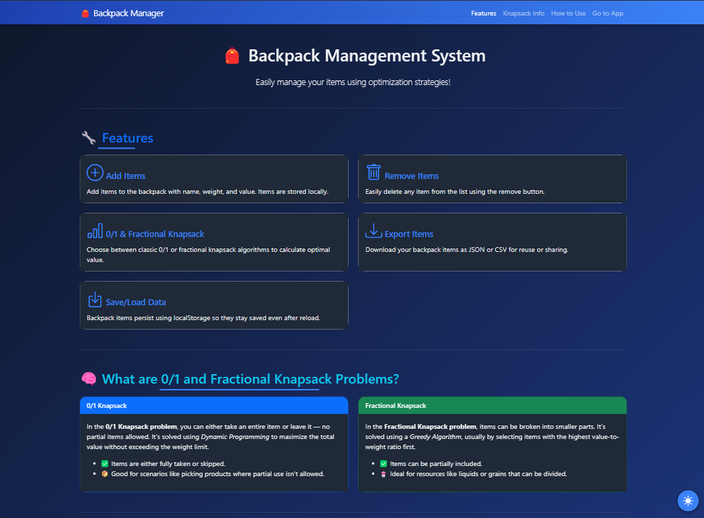
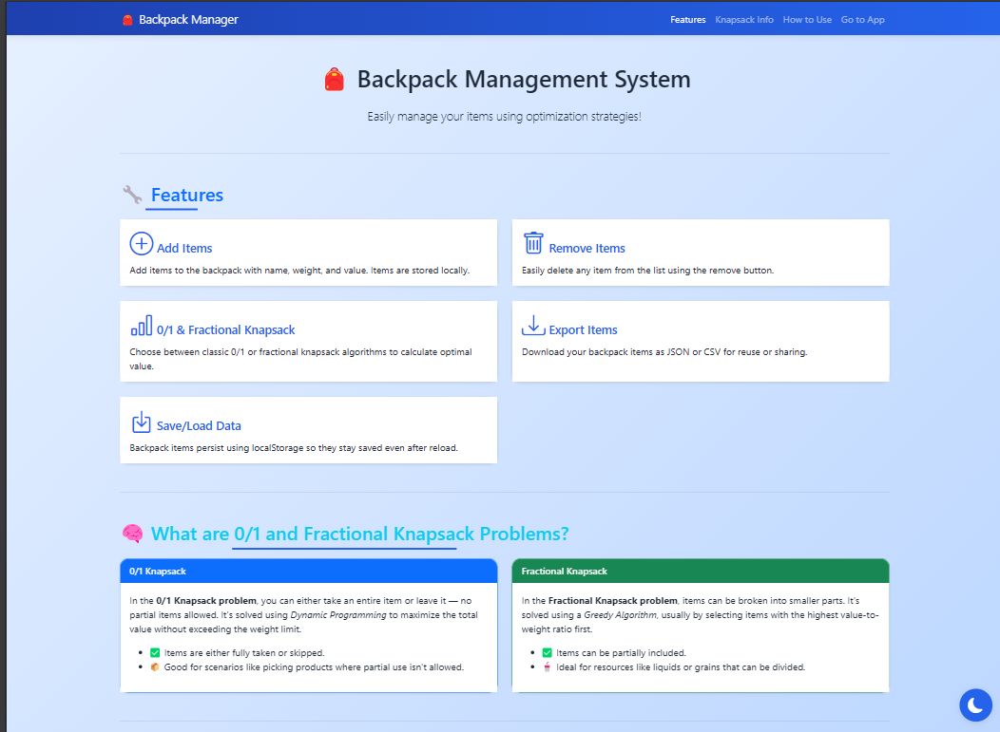

# Backpack-Manager
Simple Data algorthims and analysis project
# 🎒 Backpack Manager – Knapsack Problem Solver

An interactive web application to solve the **Knapsack Problem** using:
- 0/1 Knapsack (Dynamic Programming)
- Fractional Knapsack (Greedy Algorithm)

 
This project helps users manage a virtual backpack by adding and removing items with specific weights and values, optimizing for the most valuable combination within a given weight capacity.
--Abhiansh
---

## 📌 Project Aim

To develop a web-based Backpack Management System that allows users to **add, remove, and optimize items** using **0/1 Knapsack** and **Fractional Knapsack** algorithms through a clean and intuitive UI.

---

## 🎯 Objectives

- Manage items with name, weight, and value
- Select between 0/1 and Fractional Knapsack
- Display selected items, total profit, and used weight
- Demonstrate optimization concepts through real-world inspired interface

---

## 🛠️ Technologies Used

- **HTML** – Structure of the web interface
- **CSS** – Styling and responsive design
- **JavaScript** – Core logic for algorithms and interactivity
- **Bootstrap** – Modern and responsive UI components
- **LocalStorage** – To temporarily store user data across sessions

---

## 🧠 Algorithms Implemented

### 1. 0/1 Knapsack (Dynamic Programming)
- Items can either be fully included or excluded
- Uses a 2D array `dp[i][w]` to store maximum value for `i` items and weight `w`

**Time Complexity:** O(n * W)  
**Space Complexity:** O(n * W) (can be optimized to O(W))

### 2. Fractional Knapsack (Greedy)
- Items can be partially included
- Items sorted by value/weight ratio and picked greedily

**Time Complexity:** O(n log n)  
**Space Complexity:** O(1)

---

## 🧪 Features

- Item Input Form (Name, Price, Weight)
- Algorithm Selector (0/1 or Fractional Knapsack)
- Strategy Selector (for Fractional Knapsack)
- Result Panel: Displays selected items, total weight, and total profit
- Live result updates based on user input
- LocalStorage support for session persistence

---

## 📸 Sample Output

---

## ✅ Learning Outcomes

- In-depth understanding of **Dynamic Programming** and **Greedy Algorithms**
- Applying theory to real-world inspired projects
- Strengthened frontend web development skills (HTML/CSS/JS)
- Logical thinking and optimization approach development

---

## 🔮 Future Enhancements

- Persistent data storage using cloud or databases
- Voice input or barcode scanning for item entry
- Smart algorithm recommendations based on input
- Budgeting and cost prediction modules

---

## 📄 License

This project is open-source and free to use under the MIT License.

---

## 👨‍💻 Developed By

**Abhinash (24MCA20057)**  
Master of Computer Applications  
Chandigarh University

---

